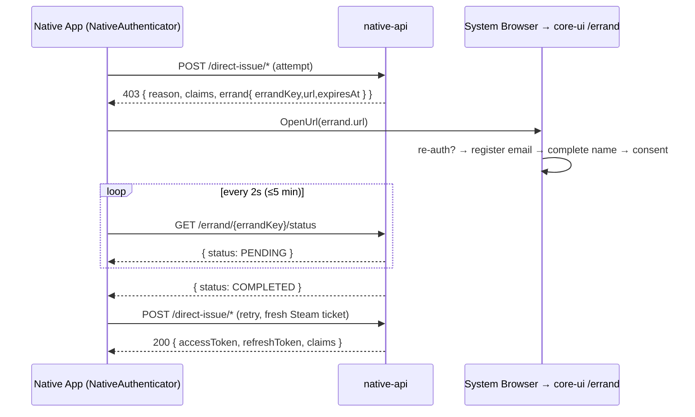

# Proposal: Native SDK upgrade — Errand-aware login & first-class claim handling

**Status:** Draft for review
**Scope:** `sdks/csharp` (`Sudomimus.Native`, with companion notes for `Sudomimus.Connect`), `specs/native.yaml`, `examples/csharp`
**Driver:** the core platform shipped the *Errand* recovery handoff and a per-claim `claims` wire view on the native direct-issue surface. The SDK predates both and silently drops them, which dead-ends real consumers (Project-Square / Bricolage).

---

## 0. TL;DR

The Native API now answers direct-issue calls with two things the SDK cannot see:

1. A **`claims`** block on every `200` (and on the claim-gate `403`) — the per-claim `{ requirement, state }` view that explains *why* a claim is or isn't in the minted token.
2. An **`errand`** handoff on claim-gate `403`s (`ClaimConsentRequired` / `RequiredClaimDataMissing`) — a 30-minute browser side-trip (`errandKey` + `url` + `expiresAt`) that lets a first-time / data-incomplete user grant consent, register an email, or complete their name, after which the app retries direct-issue and succeeds.

The SDK's `native.yaml` is at `0.3.0`, its `NativeErrorBody` models only `{ reason }`, its response DTOs have no `claims`, and there is no client for the new `GET /errand/{errandKey}/status` polling endpoint. As a result a consumer that hits a REQUIRED-claim application gets an opaque `403` and a permanently failed login.

This proposal:

- Adds the `claims` and `errand` wire types to `Sudomimus.Native` (additive, back-compatible).
- Adds a low-level `GetErrandStatusAsync` to `NativeClient`.
- Adds a **high-level `NativeAuthenticator`** that runs the full errand-recovery loop (attempt → detect claim gate → open browser → poll → retry) so consumers get a one-call login that "just works".
- Adds a typed reason layer and a small claims-convenience surface.
- Bumps `Sudomimus.Native` `1.1.0 → 1.2.0`, `specs/native.yaml` `0.3.0 → 0.4.0`, and updates the console + Godot examples.
- Flags the companion `claims`-on-`/redeem`-and-`/refresh` change for `Sudomimus.Connect`.

All changes are **additive**; existing `DirectIssueSteamTicketAsync` / `DirectIssueAccessKeyAsync` callers keep compiling and working unchanged.

> **As-built note (Phase 1, shipped).** Two design points changed against the authoritative contract during implementation:
> - The platform's `specs/native.yaml` (the cross-repo source of truth, vendored in the SDK as the `specs` **git submodule** → `sudomimus-spec`) is at **`1.0.0`**, and it marks `claims` **required** on both `200` response schemas. The `Sudomimus.Contract.Tests` oracle enforces required-set parity, so `Claims` is implemented as a **non-nullable `required`** property (not the nullable form sketched in §5.2). The live server always sends it; an older server omitting it now throws on deserialize, which is the correct contract-faithful behavior. The SDK spec was synced to `1.0.0` (not the `0.4.0` guessed in §5.8) to match the authoritative document verbatim.
> - Enums follow the SDK's established **const-string-class** idiom (`public static class` + `public const string`, e.g. `IntrospectStatus`) with the DTO property typed `string`, **not** C# `enum` + `JsonStringEnumConverter` as sketched in §5.1. This needs no JSON converter and lets the contract-test enum oracle (`StringConstants`) validate the constants against the spec's `enum` lists directly.
>
> Phase 1 landed: spec sync, the new wire types (`ClaimsStateView` / `ClaimRequirementStateView` / `ErrandHandoff` / `ErrandStatus` / `ErrandStatusResponse` / `ClaimRequirement` / `ClaimGrantState`), `claims` on the success DTOs, `claims` + `errand` on `NativeErrorBody` + `NativeApiException` (`Claims` / `Errand` / `IsClaimGate`), the `NativeReason` constants, `NativeClient.GetErrandStatusAsync`, contract-test rows, and Native unit tests — `Sudomimus.Native` bumped `1.1.0 → 1.2.0`.
>
> **Connect companion landed too** (was §5.8's "separate PR"): `claims` on `RedeemResponse` / `RefreshResponse` backed by a mirrored `Sudomimus.Connect` claims view (`Schemas/Claims.cs`), the `AuthenticationMethod.Passkey` constant corrected to the `PasskeyUsernameless` / `PasskeyReasoned` split the live spec carries, contract-test rows, and `Sudomimus.Connect` bumped `1.2.0 → 1.3.0`. Each package mirrors its own service's spec, so the claims view is intentionally duplicated across `Sudomimus.Native` and `Sudomimus.Connect` rather than shared (consumers that import both qualify the type).
>
> **Phase 2 landed** (the orchestrator, §5.6) with two invocation styles instead of a single mode flag: automatic (`AuthenticateAsync` / `AuthenticateAccessKeyAsync` / `AuthenticateSteamTicketAsync` — opens the browser, polls, retries) and manual (`TryAuthenticate*` — opens the browser, returns `DirectIssueOutcome.ErrandRequired`, caller drives the retry). Plus `NativeAuthenticatorOptions` (`OpenUrl` required, `PollInterval` / `PollTimeout` / `MaxErrandRounds` / `Progress` / `Clock`), `DirectIssueResult`, `DirectIssueOutcome`, `ErrandPhase` / `ErrandProgress`, `ErrandPollTimeoutException`, and a 7-test suite. Tokens are returned as raw strings (§5.6b) — no `Sudomimus.Connect` dependency.
>
> **Phase 3 landed** (§7): the `Sudomimus.Native` README "claims" + "errand recovery" sections with the sequence diagram, and both examples rewired — the console runs automatic mode (opens the browser via `Process.Start`, prints the claims table) and the Godot example runs access-key automatic + Steam manual (`OS.ShellOpen`, progress-driven status, claims in the result label). Both example projects build clean. Project-Square adoption (§6) and the sibling go/python/ts/java SDK updates remain downstream follow-ups.

---

## 1. Background — what changed in the platform

The native direct-issue endpoints (`POST /direct-issue/steam-ticket`, `POST /direct-issue/access-key`) are pure claim-grant **readers**: they cannot prompt a user. Before errands, a first-time Steam user of a REQUIRED-claim application was locked out with a bare `403`, and a REQUIRED claim whose account data was missing silently minted a token *without* the claim — quietly breaking the "REQUIRED means guaranteed-present" contract.

The platform fixed this on the wire (see core-monorepo `docs/authentication/errand.md`, `docs/authentication/native-client-login.md`, `docs/privacy/claim-sharing.md`):

### 1.1 `claims` on every token-issuing response

`200` bodies from `/direct-issue/*` (and `connect /redeem`, `/refresh`) now carry:

```jsonc
"claims": {
  "email":     { "requirement": "OFF|OPTIONAL|REQUIRED", "state": "UNKNOWN|GRANTED|DENIED" },
  "firstName": { "requirement": "...",                    "state": "..." },
  "lastName":  { "requirement": "...",                    "state": "..." }
}
```

`requirement` is the developer-set policy; `state` is the user's standing decision. The pair answers "why is `email` absent from my token?" — `OFF` (app never asked), `UNKNOWN` (never decided), `DENIED` (declined), or granted-but-no-data.

### 1.2 The errand handoff on claim-gate `403`s

When a REQUIRED claim is not satisfiable non-interactively, the `403` body is enriched:

```jsonc
{
  "reason": "ClaimConsentRequired",          // or "RequiredClaimDataMissing"
  "claims": { /* same shape as above */ },
  "errand": {
    "errandKey": "ernd_<courier>-<route>-<code>-<seal>",
    "url":       "https://via.sudomimus.com/errand?key=ernd_...",
    "expiresAt": "2026-06-10T12:30:00.000Z"   // ISO-8601, ~30 min out
  }
}
```

- `ClaimConsentRequired` — a consent decision is still owed (`state` is `UNKNOWN`/`DENIED` on a REQUIRED claim). The errand collects consent (+ email/name if the account lacks them).
- `RequiredClaimDataMissing` — everything is GRANTED but the account has no underlying data (e.g. a Steam-first account with no email). The errand collects the missing data.

The task list (consent / email-registration / name-completion / re-auth) is computed and stored **server-side**; the app never sees it and never branches on it.

### 1.3 The errand status polling endpoint (new)

```
GET /direct-issue/.. is retried only after the errand completes; meanwhile poll:
GET /errand/{errandKey}/status  →  { "status": "PENDING" | "COMPLETED" | "EXPIRED" }
```

- Bearer-by-key, no other auth. Pure read, **no side effects** — safe to poll every ~2s.
- `PENDING` → keep waiting. `COMPLETED` → retry direct-issue **once**. `EXPIRED` → ticket died or key never valid (the two are deliberately indistinguishable; a retried direct-issue mints a fresh errand).
- **Do not** poll by replaying direct-issue — that is the full credential round-trip (and, for Steam, needs a fresh ticket each time).
- A retried direct-issue re-hands the **same** `errandKey` while the current ticket has ≥ 15 min left and the same task scope, so accidental re-calls don't split polling state.

### 1.4 Errand recovery is also the native fix for refresh-time claim escalation

If a developer escalates a claim policy `OPTIONAL → REQUIRED` mid-session, `connect /refresh` starts returning `403 ClaimConsentRequired` (no errand is minted there). The native recovery is identical: **re-run direct-issue and follow the errand handoff.** This is why the errand orchestrator (below) should be reachable from the refresh-failure path, not only first login.

---

## 2. Current SDK state & the drift

`Sudomimus.Native` `1.1.0`. The gap, surface by surface:

| Platform wire surface (live) | What the SDK models today | Gap |
|---|---|---|
| `200` body has `claims` | `DirectIssue*Response` = `{ applicationAnchor, accessToken, refreshToken }` | **`claims` dropped** |
| claim-gate `403` has `claims` + `errand` | `NativeErrorBody` = `{ reason }` only | **`claims` + `errand` dropped** — the recovery path is invisible |
| `GET /errand/{errandKey}/status` | — | **No client method** |
| `reason` is a stable enum (`ClaimConsentRequired`, `Layer2Denied`, …) | `Reason` is a raw `string?` | No typed surface; consumers hard-code magic strings |
| `connect /redeem`,`/refresh` `200` have `claims` | `RedeemResponse`/`RefreshResponse` = no `claims` | **`claims` dropped** (companion change) |
| `native.yaml` | `0.3.0` — no `claims`, `403` schema is `{ reason }`, no errand path | **Spec is behind the implementation** |

The error pipeline already deserializes `NativeErrorBody` from the `403` body (`NativeClient.TryReadErrorBodyAsync`), so the `errand`/`claims` fields are *physically present in the HTTP response the SDK receives* — they are simply discarded because the model has no fields for them. This makes the fix low-risk: we are widening a DTO that is already being parsed.

---

## 3. How Project-Square consumes the SDK today (and where it dead-ends)

Project-Square (`Bricolage`, Godot/C#) wraps the SDK in `AuthManager` (an autoload singleton). Relevant facts from `game/src/System/AuthManager.cs`:

- **Only access-key login is implemented.** `StartAccessKeyLogin` calls `DirectIssueAccessKeyAsync`, seeds a `RotatingConnectClient`, parses the access token into a `PlayerIdentity { Subject, FirstName, LastName, EmailAddress }`.
- **The claim gate is a dead-end.** On any `NativeApiException` it does:

  ```csharp
  catch (NativeApiException ex) {
      EmitSignal(SignalName.LoginFailed, ex.Reason ?? $"http-{(int)ex.StatusCode}");
      return;
  }
  ```

  A `403 ClaimConsentRequired` / `RequiredClaimDataMissing` therefore surfaces as a generic "login failed" with no recovery — even though the server handed back a ready-to-use `errand.url`. The user cannot proceed, and there is no UI affordance to fix it.
- **Steam & browser flows are documented but not implemented.** `docs/SUDOMIMUS_AUTH.md` still describes `TrySteamSilentLogin()` / `StartBrowserLogin()` that don't exist, and references a **stale** contract: `POST /direct-realize/steam-auth-session-ticket` with `GetAuthSessionTicket` — both wrong. The live path is `POST /direct-issue/steam-ticket` with `GetAuthTicketForWebApi("sudomimus")`. (Project-Square doc fix is out of scope here but called out in §7.)
- **Magic-string reason handling.** `RefreshTokenFamilyCompromisedReason = "RefreshTokenFamilyCompromised"` is hard-coded — exactly the smell a typed reason layer removes.
- **Claims are read from the token, not the `claims` view.** `PlayerIdentity` is derived from `AccessTokenBody`. That tells the game what *is* in the token, but not *why something is missing* — so the game can't say "share your email to unlock X". The `claims` view is what enables that.

The net effect: the single most valuable new platform capability (graceful first-time consent / profile completion) is unreachable from the consumer because the SDK doesn't carry it.

---

## 4. Design goals

1. **Make the happy path one call.** A native app should be able to "log in, and if the user owes consent/data, walk them through the browser and finish" without writing a polling state machine.
2. **Surface the recovery, don't hide the mechanics.** Expose the raw `errand`/`claims`/`status` for apps that want their own UX; layer the orchestrator on top.
3. **Framework-agnostic.** The SDK must not assume *how* a URL is opened (Godot `OS.ShellOpen`, console `Process.Start`, Unity `Application.OpenURL`) — inject it.
4. **Steam-correct.** The orchestrator must re-acquire a *fresh* Steam ticket on every retry (tickets are single-use / replay-protected), so the retry unit is a **delegate**, not a captured request.
5. **Back-compatible & additive.** No breaking changes to existing types or methods. Minor version bump.
6. **Typed, not stringly.** Replace magic reason strings with a typed layer, keeping the raw string available.

---

## 5. Proposed changes (`Sudomimus.Native`)

### 5.1 Wire-model additions (new types)

```csharp
namespace Sudomimus.Native;

[JsonConverter(typeof(JsonStringEnumConverter))]
public enum ClaimRequirement { Off, Optional, Required }   // serialized OFF/OPTIONAL/REQUIRED

[JsonConverter(typeof(JsonStringEnumConverter))]
public enum ClaimGrantState  { Unknown, Granted, Denied }  // serialized UNKNOWN/GRANTED/DENIED

public sealed record ClaimRequirementStateView
{
    [JsonPropertyName("requirement")] public required ClaimRequirement Requirement { get; init; }
    [JsonPropertyName("state")]       public required ClaimGrantState  State       { get; init; }
}

public sealed record ClaimsStateView
{
    [JsonPropertyName("email")]     public required ClaimRequirementStateView Email     { get; init; }
    [JsonPropertyName("firstName")] public required ClaimRequirementStateView FirstName { get; init; }
    [JsonPropertyName("lastName")]  public required ClaimRequirementStateView LastName  { get; init; }
}

/// <summary>The browser side-trip the server hands back on a claim-gate 403.</summary>
public sealed record ErrandHandoff
{
    [JsonPropertyName("errandKey")] public required string         ErrandKey { get; init; }
    [JsonPropertyName("url")]       public required string         Url       { get; init; }
    [JsonPropertyName("expiresAt")] public required DateTimeOffset ExpiresAt { get; init; }
}

[JsonConverter(typeof(JsonStringEnumConverter))]
public enum ErrandStatus { Pending, Completed, Expired }   // serialized PENDING/COMPLETED/EXPIRED
```

> Enum casing: the wire uses `SCREAMING_SNAKE`. Configure the shared `JsonStringEnumConverter` with `JsonNamingPolicy.SnakeCaseUpper` (.NET 8) or annotate members with `[JsonStringEnumMemberName(...)]` (.NET 9) / a custom converter, so `Required` ↔ `"REQUIRED"` round-trips. The existing `s_jsonOptions` (`PropertyNameCaseInsensitive = true`) is reused.

### 5.2 `claims` on the success DTOs

```csharp
public sealed record DirectIssueSteamTicketResponse
{
    [JsonPropertyName("applicationAnchor")] public required string ApplicationAnchor { get; init; }
    [JsonPropertyName("accessToken")]       public required string AccessToken       { get; init; }
    [JsonPropertyName("refreshToken")]      public required string RefreshToken      { get; init; }
    [JsonPropertyName("claims")]            public ClaimsStateView? Claims           { get; init; } // NEW, nullable for old servers
}
// identical addition to DirectIssueAccessKeyResponse
```

`Claims` is nullable so the DTO still binds against a pre-`0.4.0` server (defensive; production always sends it).

### 5.3 `claims` + `errand` on the error envelope

```csharp
public sealed record NativeErrorBody
{
    [JsonPropertyName("reason")]  public string?          Reason  { get; init; }
    [JsonPropertyName("claims")]  public ClaimsStateView? Claims  { get; init; } // NEW
    [JsonPropertyName("errand")]  public ErrandHandoff?   Errand  { get; init; } // NEW
}
```

And convenience accessors on the exception (no behavior change to construction — the body is already parsed):

```csharp
public sealed class NativeApiException : Exception
{
    public HttpStatusCode StatusCode { get; }
    public string?        Reason     { get; }
    public NativeErrorBody? Body     { get; }

    // NEW convenience surface
    public ClaimsStateView? Claims  => Body?.Claims;
    public ErrandHandoff?   Errand  => Body?.Errand;
    public NativeReason     ReasonCode => NativeReason.Parse(Reason);

    /// <summary>True when this 403 is a claim gate carrying an errand recovery handoff.</summary>
    public bool IsClaimGate => Errand is not null &&
        (ReasonCode == NativeReason.ClaimConsentRequired ||
         ReasonCode == NativeReason.RequiredClaimDataMissing);
}
```

### 5.4 Typed reason layer

A `readonly struct` wrapper that keeps the raw string but offers typed equality + the known constants (so consumers stop hard-coding `"RefreshTokenFamilyCompromised"`-style literals):

```csharp
public readonly record struct NativeReason(string? Value)
{
    public static readonly NativeReason ClaimConsentRequired    = new("ClaimConsentRequired");
    public static readonly NativeReason RequiredClaimDataMissing = new("RequiredClaimDataMissing");
    public static readonly NativeReason Layer1Denied            = new("Layer1Denied");
    public static readonly NativeReason Layer2Denied            = new("Layer2Denied");
    public static readonly NativeReason Layer3Denied            = new("Layer3Denied");
    public static readonly NativeReason ApplicationDisabled     = new("ApplicationDisabled");
    public static readonly NativeReason AccountDisabled         = new("AccountDisabled");
    public static readonly NativeReason AccountDeleted          = new("AccountDeleted");
    public static readonly NativeReason SteamTicketInvalid      = new("SteamTicketInvalid");
    public static readonly NativeReason AccessKeyDirectDenied   = new("AccessKeyDirectDenied");
    public static readonly NativeReason ReplayProtectionAlreadySeen = new("ReplayProtectionAlreadySeen");
    public static readonly NativeReason ApplicationNotFound     = new("ApplicationNotFound");
    // EmailDomainBlocked / EmailDomainRequiresSso / SteamTicketVerificationFailed / Invalid* ...

    public static NativeReason Parse(string? raw) => new(raw);
    public bool IsKnown => /* membership test against the constants above */;
}
```

(The canonical list mirrors core-monorepo `packages/protocol` `WIRE_REASON`. Keep it a hand-curated subset of *native-reachable* reasons, not the whole enum — the SDK should only promise the ones this surface emits.)

### 5.5 Low-level errand status method on `NativeClient`

```csharp
/// <summary>Poll the status of an errand handed back on a claim-gate 403.
/// Pure read; safe to call every ~2s. Unknown/expired keys read as Expired.</summary>
public async Task<ErrandStatus> GetErrandStatusAsync(
    string errandKey,
    CancellationToken cancellationToken = default)
{
    var path = $"/errand/{Uri.EscapeDataString(errandKey)}/status";
    // GET, no body; deserialize { "status": "PENDING|COMPLETED|EXPIRED" }
}
```

### 5.6 High-level `NativeAuthenticator` — the comfort layer

The headline addition. One object that runs the whole recovery loop. The retry unit is a **delegate** so it works for both flows and re-acquires a fresh Steam ticket on each attempt.

```csharp
public sealed class NativeAuthenticator
{
    public NativeAuthenticator(NativeClient client, NativeAuthenticatorOptions? options = null);

    /// <summary>
    /// Run a direct-issue attempt, transparently recovering from claim-gate
    /// 403s via the errand browser handoff. Re-invokes <paramref name="attempt"/>
    /// after the user completes the errand (so Steam gets a fresh ticket).
    /// </summary>
    public async Task<DirectIssueResult> AuthenticateAsync(
        Func<CancellationToken, Task<DirectIssueResult>> attempt,
        CancellationToken cancellationToken = default);
}

public sealed record DirectIssueResult(
    string ApplicationAnchor,
    TokenPair Tokens,          // mirrors Sudomimus.Connect.TokenPair shape (access + refresh)
    ClaimsStateView? Claims);

public sealed record NativeAuthenticatorOptions
{
    /// <summary>How a URL is opened. REQUIRED for auto-recovery — no default,
    /// because the SDK can't know the host (Godot/Unity/console).</summary>
    public required Func<Uri, CancellationToken, Task> OpenUrl { get; init; }

    public ErrandRecoveryMode Mode { get; init; } = ErrandRecoveryMode.Poll;
    public TimeSpan PollInterval   { get; init; } = TimeSpan.FromSeconds(2);
    public TimeSpan PollTimeout    { get; init; } = TimeSpan.FromMinutes(5);
    public int      MaxErrandRounds { get; init; } = 2;   // re-mint after EXPIRED, bounded

    /// <summary>Progress hook for UI ("waiting for browser…", "completed, finishing login…").</summary>
    public IProgress<ErrandProgress>? Progress { get; init; }

    /// <summary>Manual-mode override: completes when the user clicks "I'm done"
    /// instead of (or in addition to) status polling. Ignored in Poll mode.</summary>
    public Func<ErrandHandoff, CancellationToken, Task>? WaitForUserSignal { get; init; }
}

public enum ErrandRecoveryMode { Poll, Manual }

public sealed record ErrandProgress(ErrandPhase Phase, ErrandHandoff? Errand, ClaimsStateView? Claims);
public enum ErrandPhase { Attempting, BrowserOpened, Polling, Retrying, Succeeded, Expired }
```

**`AuthenticateAsync` algorithm:**

```
round = 0
loop:
  try:
     result = await attempt(ct)         // a 200
     report Succeeded; return result
  catch NativeApiException ex when ex.IsClaimGate:
     round++; if round > MaxErrandRounds: throw
     report BrowserOpened(ex.Errand, ex.Claims)
     await options.OpenUrl(new Uri(ex.Errand.Url), ct)
     status = await WaitForErrandAsync(ex.Errand, ct)   // polls GetErrandStatusAsync, or WaitForUserSignal
     if status == Completed: report Retrying; continue   // re-invoke attempt (fresh Steam ticket)
     if status == Expired:   report Expired;  continue   // retry mints a fresh errand, bounded by MaxErrandRounds
  // any non-claim-gate NativeApiException (Layer denials, AccountDisabled,
  // SteamTicketInvalid, replay 409, 5xx, …) bubbles unchanged — not recoverable here.
```

Usage — Steam (note the fresh ticket per attempt):

```csharp
var auth = new NativeAuthenticator(nativeClient, new NativeAuthenticatorOptions {
    OpenUrl  = (uri, ct) => { OS.ShellOpen(uri.ToString()); return Task.CompletedTask; }, // Godot
    Progress = new Progress<ErrandProgress>(p => GD.Print($"[errand] {p.Phase}")),
});

DirectIssueResult login = await auth.AuthenticateAsync(async ct =>
{
    string ticketHex = await steam.AcquireWebApiTicketHexAsync("sudomimus", ct); // fresh each call
    var resp = await nativeClient.DirectIssueSteamTicketAsync(new DirectIssueSteamTicketRequest {
        ApplicationAnchor = "sudoarc-bricolage",
        SteamTicketHex    = ticketHex,
        SteamAppId        = STEAM_APP_ID,
    }, ct);
    return new DirectIssueResult(resp.ApplicationAnchor,
        new TokenPair { AccessToken = resp.AccessToken, RefreshToken = resp.RefreshToken },
        resp.Claims);
}, ct);

await rotating.SeedAsync(login.Tokens);   // hand off to Sudomimus.Connect as today
```

Usage — access key (no fresh-credential subtlety, same shape):

```csharp
DirectIssueResult login = await auth.AuthenticateAsync(async ct => {
    var resp = await nativeClient.DirectIssueAccessKeyAsync(req, ct);
    return new DirectIssueResult(resp.ApplicationAnchor,
        new TokenPair { AccessToken = resp.AccessToken, RefreshToken = resp.RefreshToken }, resp.Claims);
}, ct);
```

> **Package boundary.** `TokenPair` currently lives in `Sudomimus.Connect`. To keep `Sudomimus.Native` dependency-free, either (a) introduce a tiny shared `Sudomimus.Abstractions` package holding `TokenPair` + the claims types and have both depend on it, or (b) have `DirectIssueResult` expose raw `AccessToken`/`RefreshToken` strings and let the caller build the `Connect.TokenPair`. **Recommendation: (b)** for this minor release (zero new packages, zero new cross-deps); revisit (a) if a future release wants `NativeAuthenticator` to seed a `RotatingConnectClient` directly.

### 5.7 Claims convenience surface

So consumers can reason about claims without re-deriving the policy/grant truth table:

```csharp
public static class ClaimsStateViewExtensions
{
    /// <summary>A claim the app marked REQUIRED but the user hasn't satisfied
    /// (state != Granted). These are what block a non-interactive issue.</summary>
    public static bool HasUnsatisfiedRequired(this ClaimsStateView c);
    public static IReadOnlyList<ShareableClaim> UnsatisfiedRequired(this ClaimsStateView c);

    /// <summary>Will this claim appear in the minted token? (requirement != Off && state == Granted)</summary>
    public static bool IsIncluded(this ClaimRequirementStateView v)
        => v.Requirement != ClaimRequirement.Off && v.State == ClaimGrantState.Granted;

    /// <summary>Human-facing "why is this claim missing" reason for prompts.</summary>
    public static ClaimAbsenceReason Explain(this ClaimRequirementStateView v); // NotRequested/Undecided/Declined/Included
}

public enum ShareableClaim { Email, FirstName, LastName }
public enum ClaimAbsenceReason { Included, NotRequested, Undecided, Declined }
```

This is what lets Bricolage render "Share your email to enable cloud saves" off the `200`'s `claims` block, instead of guessing from a missing token field.

### 5.8 Versioning

- `Sudomimus.Native`: **`1.1.0 → 1.2.0`** (additive; new types + methods + the authenticator; no breaking changes).
- `specs/native.yaml`: **`0.3.0 → 0.4.0`** — add `claims` to the two `200` schemas, add `claims`+`errand` to the `403` `Error` schema (or a dedicated `ClaimGateError`), and add the `GET /errand/{errandKey}/status` path + `ErrandStatusResponse` schema. The `Sudomimus.Contract.Tests` suite then enforces parity.
- Companion (separate PR, `Sudomimus.Connect` minor bump): add nullable `Claims` to `RedeemResponse` and `RefreshResponse`. Useful so apps can detect claim escalation after `/refresh` and route into `NativeAuthenticator` (§1.4).

---

## 6. Project-Square adoption (before / after)

The whole point. `AuthManager.StartAccessKeyLogin` and a new Steam path collapse to "call the authenticator".

**Before** (claim gate = dead end):

```csharp
catch (NativeApiException ex) {
    EmitSignal(SignalName.LoginFailed, ex.Reason ?? $"http-{(int)ex.StatusCode}");
    return;   // user stuck; errand.url thrown away
}
```

**After** (errand-aware, ~1 new field + reuse of the authenticator):

```csharp
private NativeAuthenticator _authenticator;

public override void _Ready() {
    // ... existing client setup ...
    _authenticator = new NativeAuthenticator(_nativeClient, new NativeAuthenticatorOptions {
        OpenUrl  = (uri, ct) => { OS.ShellOpen(uri.ToString()); return Task.CompletedTask; },
        Progress = new Progress<ErrandProgress>(OnErrandProgress),  // drive a "finish setup in your browser" banner
    });
}

public async Task StartAccessKeyLogin(string id, string secret) {
    try {
        var login = await _authenticator.AuthenticateAsync(async ct => {
            var resp = await _nativeClient.DirectIssueAccessKeyAsync(new DirectIssueAccessKeyRequest {
                ApplicationAnchor = ApplicationAnchor, AccessKeyIdentifier = id, AccessKeySecret = secret,
            }, ct);
            return new DirectIssueResult(resp.ApplicationAnchor,
                new TokenPair { AccessToken = resp.AccessToken, RefreshToken = resp.RefreshToken }, resp.Claims);
        });
        await _rotating.SeedAsync(login.Tokens);
        Identity = ParseAccessTokenIdentity(login.Tokens.AccessToken);
        // NEW: stash login.Claims so the UI can nudge optional-claim sharing
        EmitSignal(SignalName.LoginSucceeded);
    }
    catch (NativeApiException ex) {   // genuine denials only now (Layer*/AccountDisabled/…)
        EmitSignal(SignalName.LoginFailed, ex.ReasonCode.Value ?? $"http-{(int)ex.StatusCode}");
    }
}
```

Companion Project-Square fixes (out of scope for the SDK, listed for tracking):
- Implement the Steam path on the corrected contract (`/direct-issue/steam-ticket` + `GetAuthTicketForWebApi("sudomimus")`), replacing the stale `docs/SUDOMIMUS_AUTH.md`.
- Route `RefreshAsync`'s `403 ClaimConsentRequired` (claim escalation, §1.4) back through `_authenticator` instead of forcing full re-login.
- Replace the `RefreshTokenFamilyCompromisedReason` magic string with the typed `NativeReason` / its Connect equivalent.

---

## 7. Docs & examples to update

1. **`specs/native.yaml` → `0.4.0`** (§5.8). Source of truth; gates the contract tests.
2. **`sdks/csharp/src/Sudomimus.Native/README.md`** — add an "Errand recovery & claims" section with the `NativeAuthenticator` snippet and a sequence diagram.
3. **`examples/csharp/console/Program.cs`** — demonstrate the full loop: hit a REQUIRED-claim app, print the `claims` table, open the errand URL (`Process.Start`), poll, retry, print the now-present claim.
4. **`examples/csharp/godot/`** — wire `OS.ShellOpen` as `OpenUrl`, show a "Finish setup in your browser" panel driven by `ErrandProgress`, then complete login. This doubles as the reference Project-Square should mirror.
5. **Cross-SDK note** — the same wire change applies to `sdks/{go,python,typescript,java}`. This proposal implements C# first (Project-Square's consumer); file sibling issues so the spec bump doesn't leave the other SDKs silently dropping `claims`/`errand` too.

### Sequence (errand-aware login) for the README



---

## 8. Recommendations & trade-offs

- **Poll vs. "I'm done" button.** Default to **Poll** mode — it auto-advances with no extra UI and the status endpoint is explicitly built for ~2s polling. Offer **Manual** (`WaitForUserSignal`) for apps that prefer an explicit button or run somewhere a background timer is awkward. Supporting both is cheap (one `await` seam).
- **Open the system browser, never embed.** The errand runs real authentication ceremonies (passkey, OAuth, OTP) — embedded webviews break passkeys and are a phishing-perception risk. Inject `OpenUrl` and use the OS browser. This is also why `OpenUrl` has **no default**: forcing the consumer to supply it prevents a silently-wrong default.
- **Bound the retry loop.** `MaxErrandRounds = 2` stops an `EXPIRED → re-mint → EXPIRED` spin. Each round after an `EXPIRED` legitimately mints a fresh errand, so a small bound (not 1) is right; surface `Expired` via `Progress` so the UI can say "took too long, try again".
- **Don't poll by replaying direct-issue.** The orchestrator polls the dedicated status endpoint. Replaying direct-issue is a full credential round-trip and (Steam) needs a fresh ticket; the platform docs call this out explicitly.
- **Keep `Sudomimus.Native` dependency-free.** Prefer the "return raw token strings" option (§5.6b) over pulling in `Sudomimus.Connect` or minting a new shared package for a minor release.
- **Typed reasons are a curated subset.** Only promise the reasons this surface actually emits; don't mirror the entire platform `WIRE_REASON` (it would rot). Keep the raw `string` available for the long tail.
- **Claims belong on the result, not just the token.** Return `ClaimsStateView` from login so the app can prompt for *optional* sharing (the token alone can't distinguish "OFF" from "user declined").
- **Nullable `Claims` for forward/backward safety.** A `0.4.0` server always sends it; nullable means an older server (or a replayed fixture) still binds.

### Out of scope (deliberately, matching the platform v1)

- On-demand consent minting for **pure-OPTIONAL** apps on the native path (the platform itself doesn't auto-prompt these yet; Oversight staff-mint is the only path). The SDK can't conjure an errand the server won't mint.
- Deep-link **return** to the native app after the browser errand (platform v1 has no return hook; the app resumes via polling / user signal).
- Errand handling on `connect /redeem` / `/refresh` and on OIDC `/token` (the platform mints no errand there; native recovery is re-running direct-issue).

---

## 9. Rollout plan

| Phase | Work | Gate |
|---|---|---|
| 1 | `specs/native.yaml → 0.4.0`; new wire types (§5.1); `claims` on success DTOs (§5.2); `claims`+`errand` on `NativeErrorBody` + exception accessors (§5.3); `NativeReason` (§5.4); `GetErrandStatusAsync` (§5.5) | Contract tests green; unit tests for enum round-trips + `403` body parse |
| 2 | `NativeAuthenticator` + options + progress (§5.6); claims extensions (§5.7) | Unit tests for the loop: claim-gate→browser→poll→retry, `EXPIRED` re-mint bound, non-claim-gate bubble |
| 3 | Examples (console + Godot) + README + sequence diagram (§7) | Examples build & run against a REQUIRED-claim test app |
| 4 | Publish `Sudomimus.Native 1.2.0`; companion `Sudomimus.Connect` `claims` PR; sibling issues for go/python/ts/java | NuGet published; Project-Square bumps and adopts |

Phases 1–2 are the SDK; 3–4 are packaging/rollout. Project-Square adoption (§6) follows the `1.2.0` publish.

---

## 10. Open questions

1. **Shared types package?** Defer `Sudomimus.Abstractions` (`TokenPair` + claims) to a later release, or introduce it now so `NativeAuthenticator` can seed a `RotatingConnectClient` end-to-end? (Recommendation: defer.)
2. **Should the authenticator own the `RotatingConnectClient` seeding** (a `NativeSession` façade spanning Native+Connect), or stay token-string-pure and let the app seed? (Recommendation: stay pure for `1.2.0`; evaluate a `Session` façade once both SDKs carry `claims`.)
3. **`ExpiresAt` as `DateTimeOffset`** (proposed) vs. raw `string`. Parsing is convenient but couples to ISO-8601 exactness; the server emits `Date.toISOString()` so `DateTimeOffset` is safe. (Recommendation: `DateTimeOffset`.)
4. **Enum unknown-value tolerance.** If the platform later adds a claim or status value, a strict `JsonStringEnumConverter` throws. Add a tolerant converter (unknown → a sentinel) for forward-compat? (Recommendation: yes for `ErrandStatus`/claims enums — treat unknown `status` as `Pending`-safe or surface a sentinel.)
```
