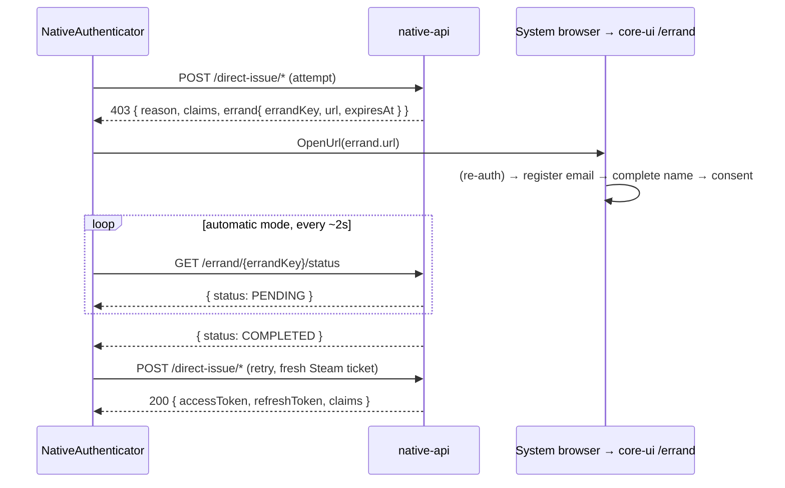

# Sudomimus.Native

C# SDK for the [Sudomimus](https://sudomimus.com) Native API. Exchanges a
Steam Web API auth ticket for application access and refresh tokens in a
single round trip.

Mirrors the [`@sudomimus/native`](https://www.npmjs.com/package/@sudomimus/native)
TypeScript SDK. Generic .NET 8 package — no Steam SDK, no Godot dependency.
Works in plain console apps, Godot, Unity, ASP.NET Core, or any .NET host.

```csharp
using Sudomimus.Native;

using var http = new HttpClient();
var client = new NativeClient(NativeClient.ProductionBaseUrl, http);

var response = await client.DirectIssueSteamTicketAsync(new DirectIssueSteamTicketRequest
{
    ApplicationAnchor = "anchor-xxx",
    SteamTicketHex = ticketHex,    // bytes from ISteamUser::GetAuthTicketForWebApi("sudomimus"), hex-encoded
    SteamAppId = 480,
});

// response.AccessToken / response.RefreshToken — parse with Sudomimus.Token.
```

For tickets to verify, the calling Steam client SDK **must** pass identity
`"sudomimus"` to `GetAuthTicketForWebApi(identity)` — Steam binds the issued
ticket to the identity string and the server hardcodes the same value. See
[`NativeConstants.SteamTicketIdentity`](./NativeConstants.cs).

## Claims on every response

Every direct-issue `200` carries a `claims` view — the per-claim policy joined
with the user's standing decision. It answers "why is `email` absent from my
token?": `OFF` (the app never asks), `UNKNOWN` (user never decided), `DENIED`
(declined), or granted.

```csharp
ClaimsStateView claims = response.Claims;
// claims.Email.Requirement -> ClaimRequirement.Off / Optional / Required
// claims.Email.State       -> ClaimGrantState.Unknown / Granted / Denied
bool emailInToken = claims.Email.Requirement != ClaimRequirement.Off
                 && claims.Email.State == ClaimGrantState.Granted;
```

## Errand recovery for claim-gated logins

When an application marks a claim **REQUIRED** and the user has not yet granted
it (or the account lacks the data, e.g. a Steam-first account with no email),
direct-issue cannot prompt — it returns a `403` whose body carries an **errand
handoff**: a short-lived browser URL where the user grants consent / completes
the missing data. After they finish, retrying direct-issue succeeds.

You can drive this by hand off `NativeApiException` …

```csharp
catch (NativeApiException ex) when (ex.IsClaimGate)
{
    // ex.Errand.Url        — open in the system browser
    // ex.Errand.ErrandKey  — poll GetErrandStatusAsync(key) until COMPLETED
    // ex.Claims            — what is still owed
}
```

… or let **`NativeAuthenticator`** run the loop for you. It does not open the
browser itself (the SDK can't know your host) — it calls the `OpenUrl` callback
you supply (Godot `OS.ShellOpen`, Unity `Application.OpenURL`, console
`Process.Start`). Two invocation styles:

**Automatic** — opens the browser, polls the errand, retries, returns tokens:

```csharp
var auth = new NativeAuthenticator(client, new NativeAuthenticatorOptions
{
    OpenUrl = (uri, _) => { /* OS.ShellOpen / Process.Start */ return Task.CompletedTask; },
    Progress = new Progress<ErrandProgress>(p => Console.WriteLine($"[errand] {p.Phase}")),
});

DirectIssueResult login = await auth.AuthenticateAccessKeyAsync(new DirectIssueAccessKeyRequest
{
    ApplicationAnchor = "anchor-xxx",
    AccessKeyIdentifier = id,
    AccessKeySecret = secret,
});
// login.AccessToken / login.RefreshToken / login.Claims
```

For Steam, pass a **factory** so each attempt (and each retry) gets a fresh,
single-use ticket:

```csharp
DirectIssueResult login = await auth.AuthenticateSteamTicketAsync(async ct =>
    new DirectIssueSteamTicketRequest
    {
        ApplicationAnchor = "anchor-xxx",
        SteamTicketHex = await AcquireFreshTicketHexAsync(ct),
        SteamAppId = 480,
    });
```

**Manual** — opens the browser and hands the errand back; your app decides when
to retry (e.g. an "I'm done" button). No polling:

```csharp
DirectIssueOutcome outcome = await auth.TryAuthenticateAccessKeyAsync(request);
if (outcome is DirectIssueOutcome.ErrandRequired errand)
{
    // browser already opened; show your own "finished?" affordance, then:
    outcome = await auth.TryAuthenticateAccessKeyAsync(request); // retry on the user's signal
}
if (outcome is DirectIssueOutcome.Authenticated ok)
{
    // ok.Result.AccessToken / ok.Result.RefreshToken / ok.Result.Claims
}
```

Non-claim-gate failures (Layer denials, account disabled, replay, …) propagate
as `NativeApiException` in both styles — only the recoverable claim gate is
handled.


